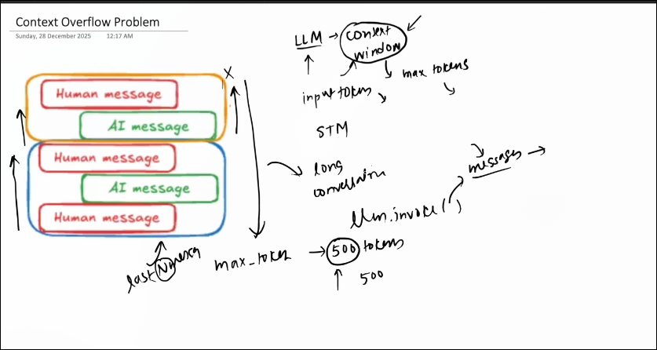
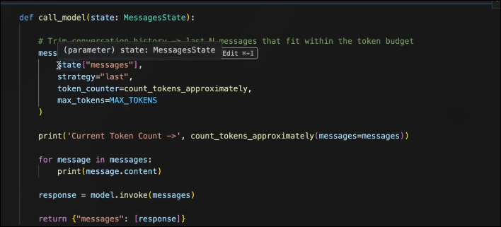
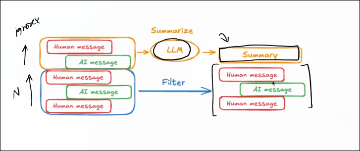

for implementing the short term memory we use the 

1. check pointer 
2. threads 

see the reference 

# Context OverFlow problem 
an error that occurs when the total data (input prompt, system instructions, and generated output) exceeds a Large Language Model's (LLM) maximum token limit

# OverCome methods 

1. TRiming  :) Remove the un neccessary message 

set max token count and max token count exceed to the set remove the oldest messages 

function  by langGraph :) trim_message 

Flaws they delete the old messages 
and the old messages not deleted 
only the context is trimmed 

2. Summarization 

:) summarise the old message and  send the latest messages  adn the old messages were deleted 

imports 

from lang-chain.messages import RemoveMessages 