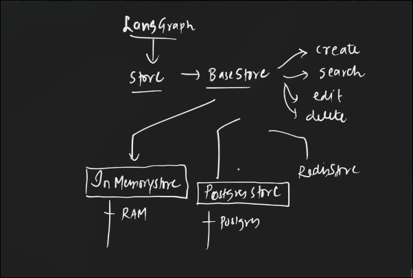
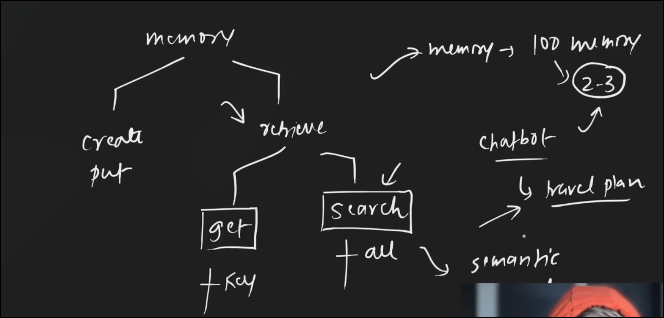
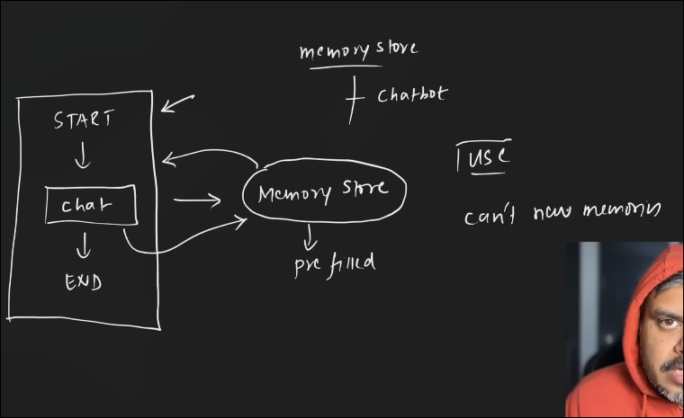
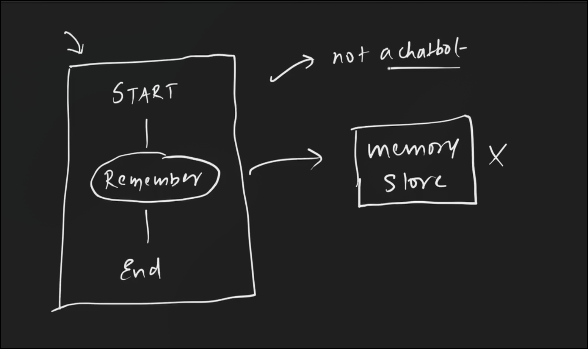
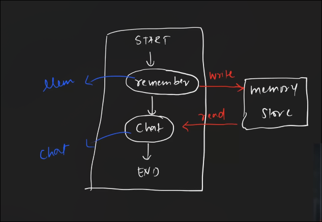

this can be implemented using the class called BaseStore 

create memeory
existing memeory search , update , delete 

# How to implement the memory store 

Creating a name space  :) to organise the memory we use the namespace 

# put method :) particular namespace main new memoery create krta hai 
nned 3 things namespace ,  key , value 

But the problem is we need the specific memory 

problem is solved using the semantic  search :) search basics on the meaning 

How to implement the sementic search 
-> you have to use the embiding models 

# Use The existance memory 

cannot create the new memory 

# now the code for creating a new memory in the vector store 

# Strategies for removing the duplicate data in the  database dude 

-> Send the user message 
-> send the  existing messages 
and also give us list of memories and boolen is the extracted memory is in the memory or not [T/F]

iterate to the list and add the memory that has F in the list of memory 

# combined WorkFlow 

memory update and memory create 

