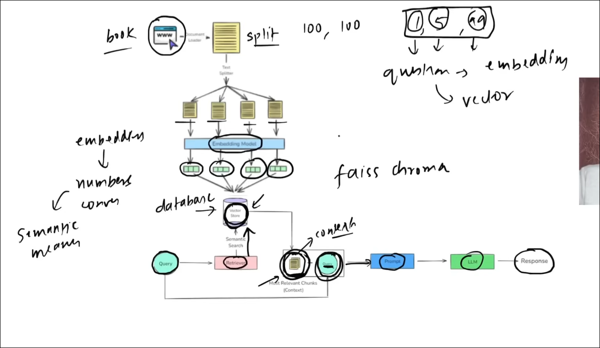

1.  RAG :)) retrival argument generation 

Solved the knowledge cut off 
privacy  if you dont want to expose the private document  to llm 

LLM hallucination refers to the phenomenon where llm  contains factual inaccuracies, nonsensical content, or fabricated information

The whole stage of rag is this 

if u want to implement  the rag make this as a tool 

2. HITL     :) Human In The Loop 

    is a design approach in ai system where a human actively participates at critical points  of the workflow - either suspend approve and correct or guide the models output 

we  use the hitl because 
 

to  help the agentic system 
to maintain  the accountability

htl ensures the accuracy a=