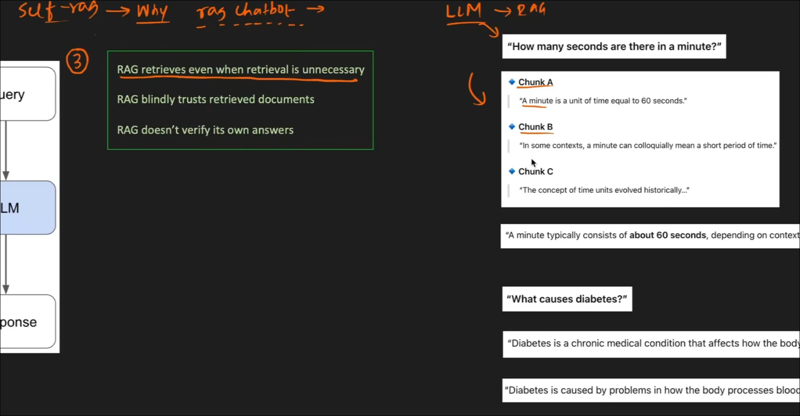
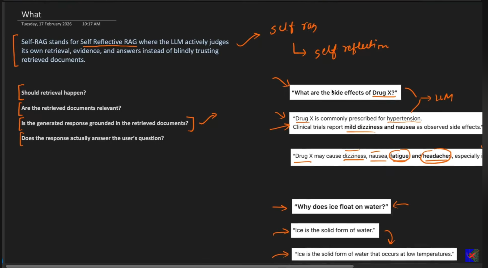
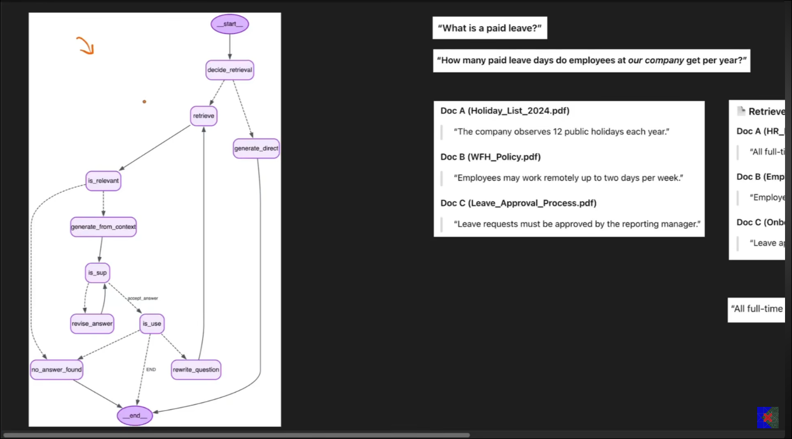

# Why self rag 

-> because of indiscriminate retrieval :)The retriever pulls documents/chunks without properly filtering relevance, quality, or context.

So instead of retrieving the most useful information, it retrieves a lot of noisy or loosely related chunks.

# Self Rag 

# Architecture of self rag 

