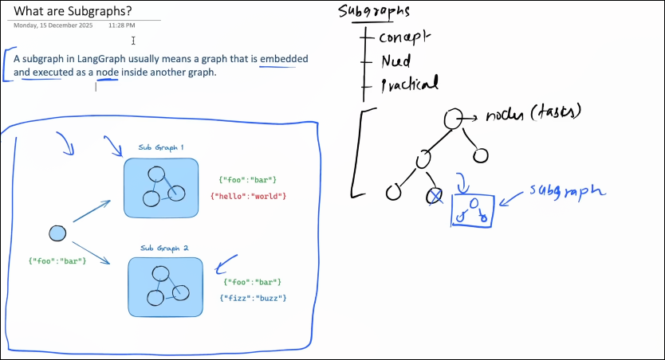

# Need Of Sub-Graph

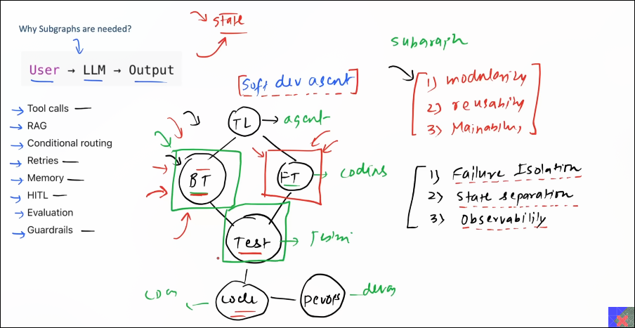

# Types of the SubGraph 

1) invoke a graph from a node  :) one node is Reference  to the  other one  

2) Add a graph as a node :) The node is Contain the subGraph !!  

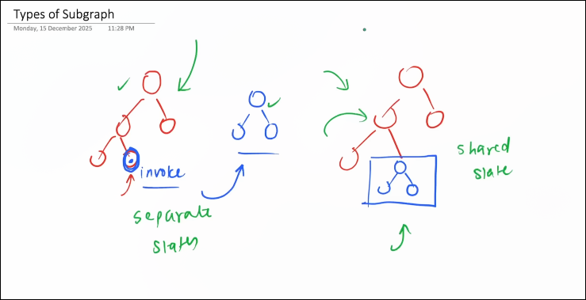

# Important Links of Sub-Graph

https://docs.langchain.com/oss/python/langgraph/use-subgraphs?utm_source=chatgpt.com

# Sample of SubGraph 

https://docs.langchain.com/oss/python/langgraph/use-subgraphs?utm_source=chatgpt.com#stream-subgraph-outputs

# Facts

llm don't have any intrinsic memory 

# function 

y = f@(X)

We have to develop the feature of the memory 

# Context Window 

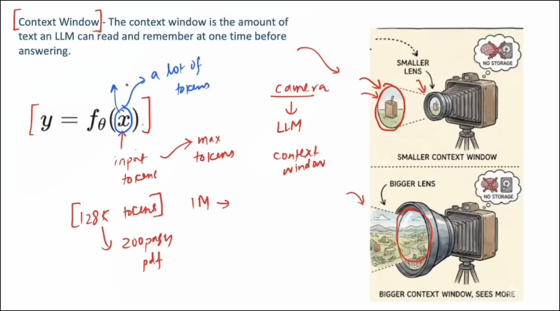

# In-Context Learning :) 

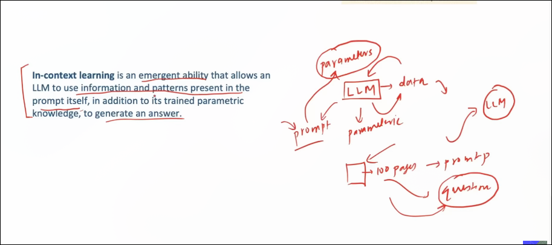

# The Solution Principle 01

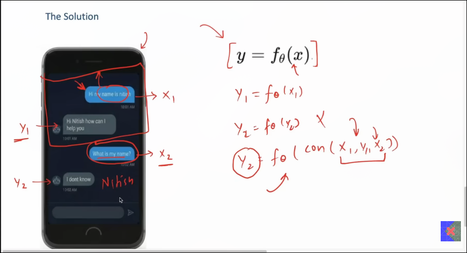

# short term Memory :) 
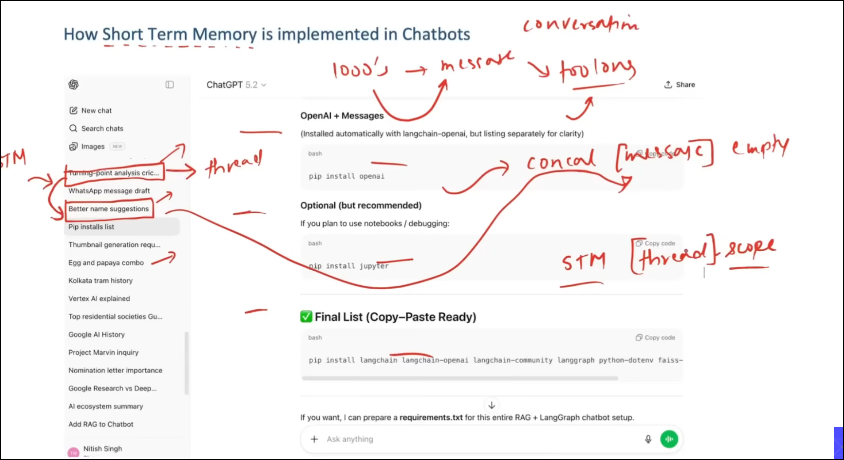

# Problems with the short term memory 

problem 1 ) this is very fragile  :) can break easily 

u can use the database that is persistance ! 

problem 2 _) The context window problem 
mazimum number of token which is used by the llm while generating the answer 

The solution 
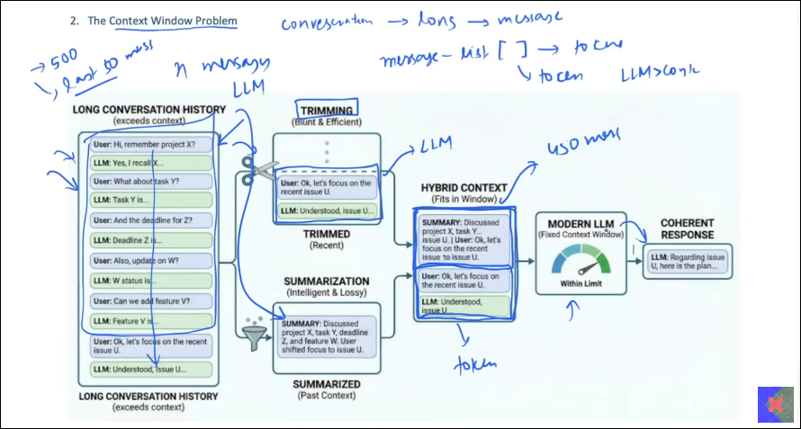
 

3>) short term memory is thread scoped 
STM is thread-scoped

A. Loss of user continuity across conversations
B. Learning never compounds over time
C. Cross-thread reasoning is impossible 

# Solution 

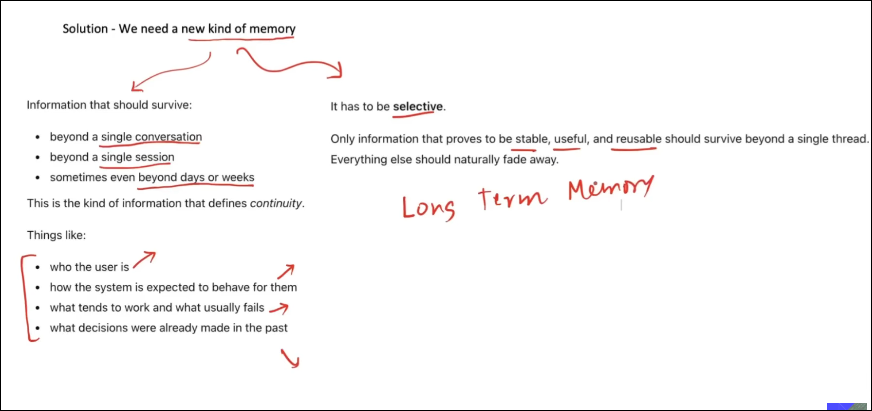
# Types of long term memory 

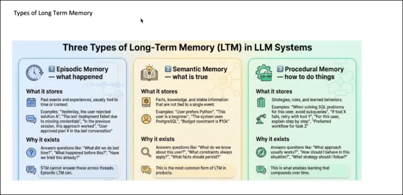

# How does the Long term memory works 
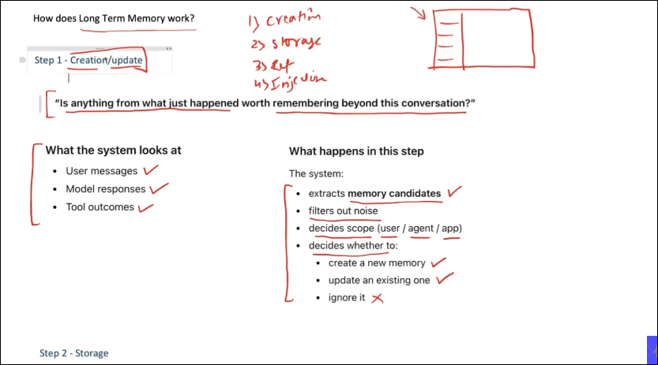
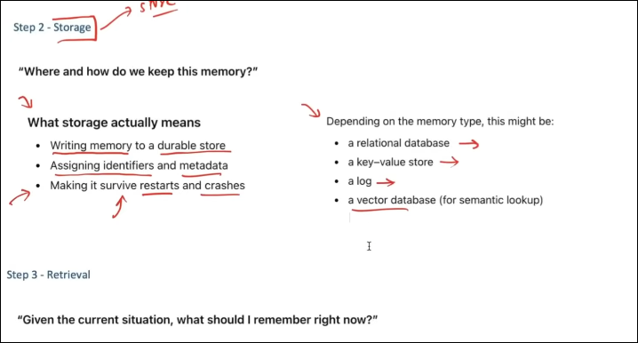
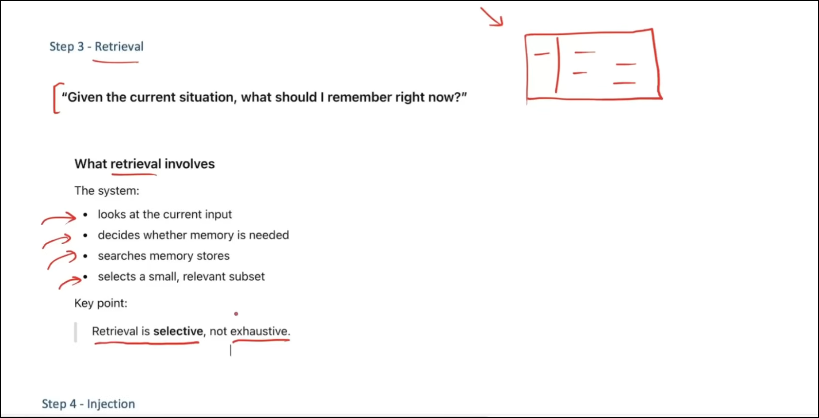
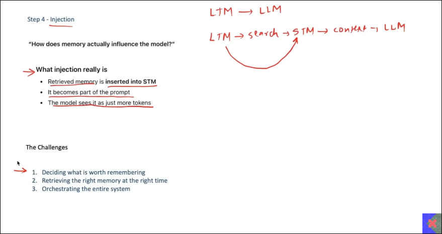

# Famous Library 

The famous for managing the memory is LangMem 

and the plat-form is mem) and also the super-memory 
and also google research paper is :) titans + meiras helping ai have long term memory 