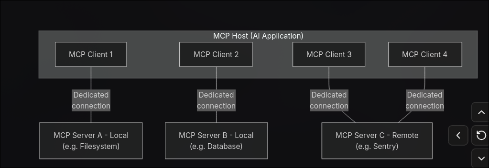

MCP Architecture

PRIMITIVES IN MCP 

The things server can offer to host 

Example git hub server 

tools  :) Actions the ai ask the server to perform  
Resource :)  Structured data sources that the ai can read    and it is dynamic in  nature 
prompts  primptive :)   predefined prompts templated or instruction that the server offers to help shape the ai Behavious 
