MCP LIFE CYCLE 

 the complete sequence of steps that govern how a host and server establish use and end a connection during a session 

 STage 
 1. initialization 
 2. operation 
 3. shutdown 

 1. Intilialization 

 must be  the first interaction between  client and servre 

 first match the protocol version and exchange and negotiate capabilities (what the server and client do )

 INItialization has three phases 

 Step 1 the client send a intiliaze request containing 
 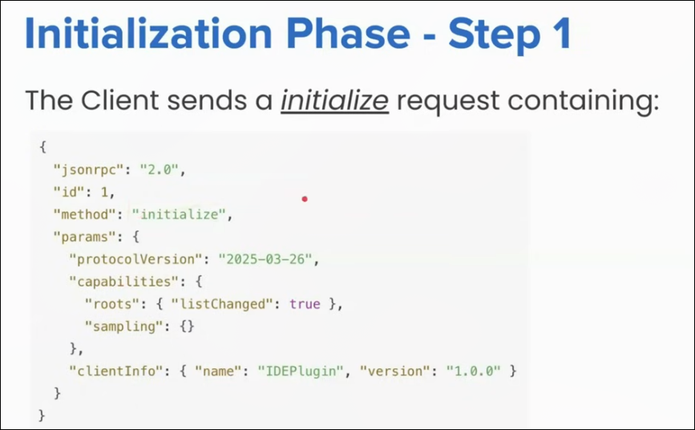

 Step 2 
 the server send its own capabilites and info 
 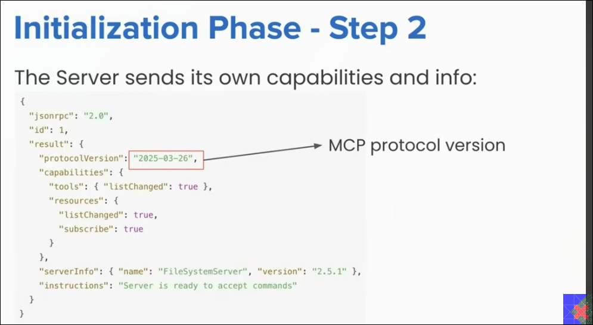
 
 Step 3 

After successfull intialization the client  must send an initialized notification to indicate it is ready to began normal operations 

 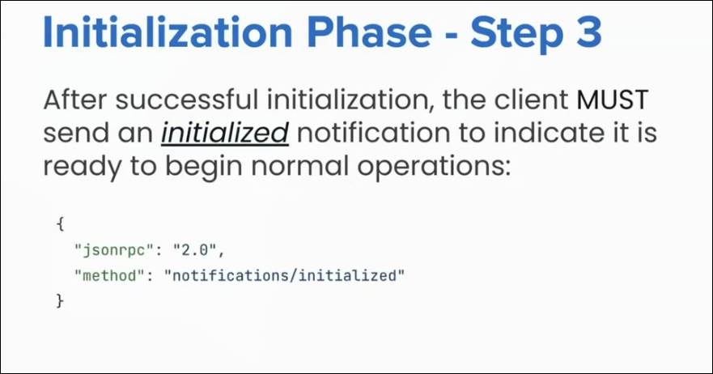

 Now the client and server connected 

Rule 1 

 The client did not send other request other than ping befor the server has responed the initialze request 

 Rule 2 
 server didnot send  any request other than ping and logging before receiving the initialized notification 

VERSION NEGOTIATION 

if version mismatch in the protocol version than the client check what are the supported version they can handel 

if they supported version did not match with the server version -> client disconnected 

CAPABILITY NEGOTIATION 

means telling each other what are the feature  offers by both means setting expectation what things and what are  they 

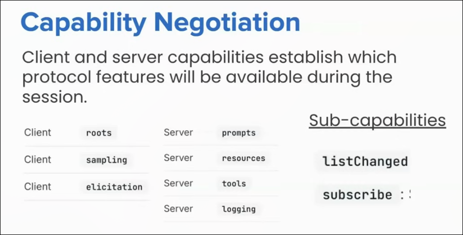

Operation Phase 
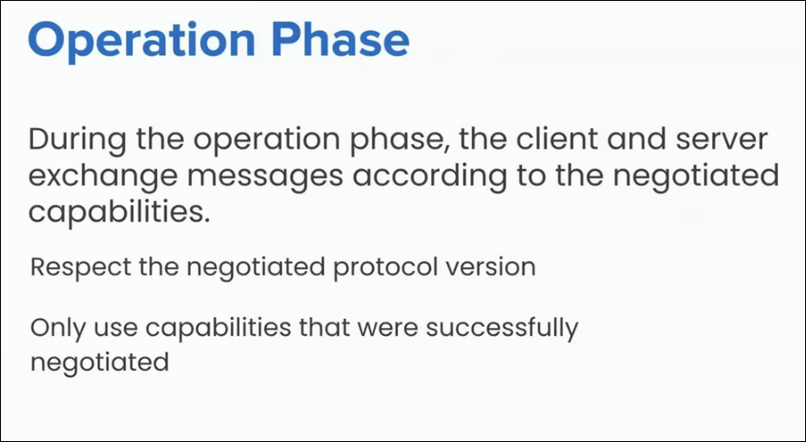

divided in 2 parts 

part 1 

sending request to server and knowing what are  the tool they can offer 

/tool 

and server  response 

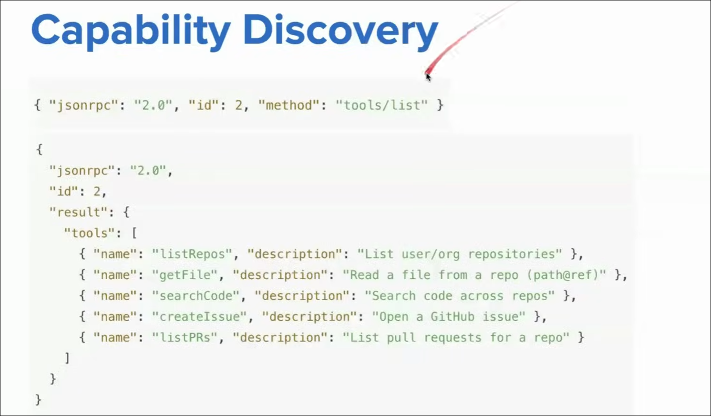

part 2 
TOOL CALLING 
 

3 rd PHASE 

3. SHUT-DOWN 

session between client and server disconnected 

no json/rpc messages are not send 
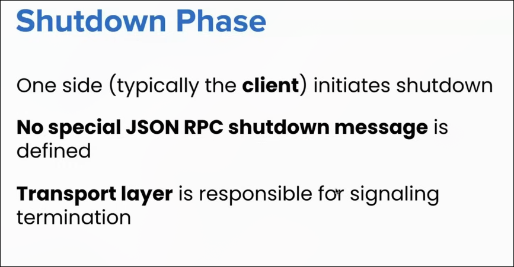

TRANSPORT LAYER 

SHUTDOWN IN STDIO (in local server )

Shutdown in STDIO
Client-initiated shutdown (SHOULD):
Close input stream to the child process (server)
Wait for server to exit
Send SIGTERM if server does not exit in time  (politely kill )
Send SIGKILL if still unresponsive  ( turant kill )

Server -initiated shutdown (may):
Close output stream to the client
Exit process

SHUTDOWN UN HTTP 

shutdown in remote server 

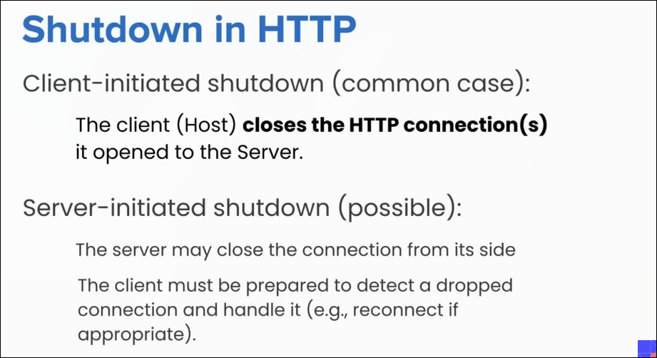

SPECIAL CASES 

PINGS :) 
    Light weight request/response method defined in MCP 
    
    PURPOSE :) CHECK  is the server or host is alive or not 

    both way possible server can send to host or host send to user 

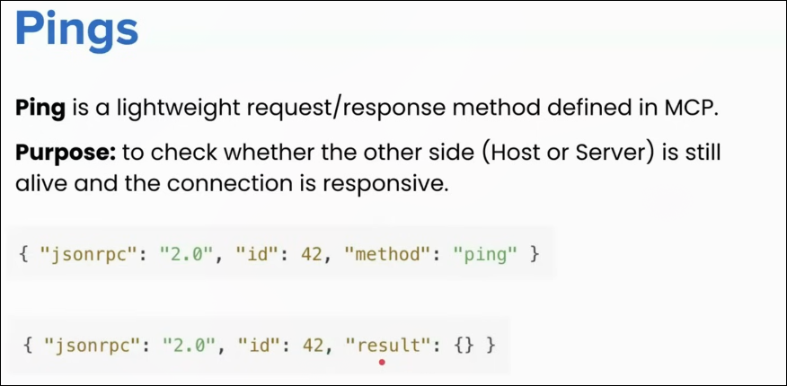

when is the ping used ? 
=-> usefull for checking if the other side is up or not 

send periodically send request to make the connection alive 

ERROR HANDLING 

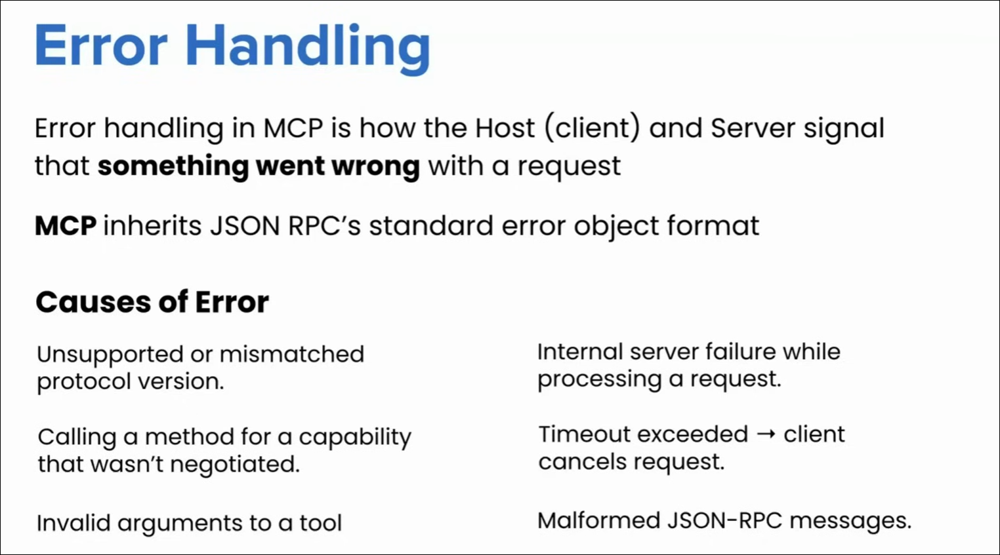

ERROR OBJECT STRUCTURE 
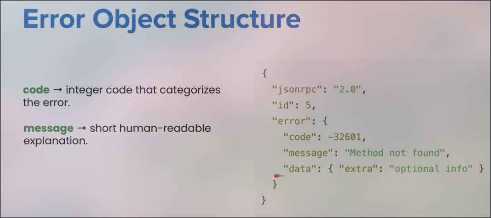

COMMON ERROR CODES 

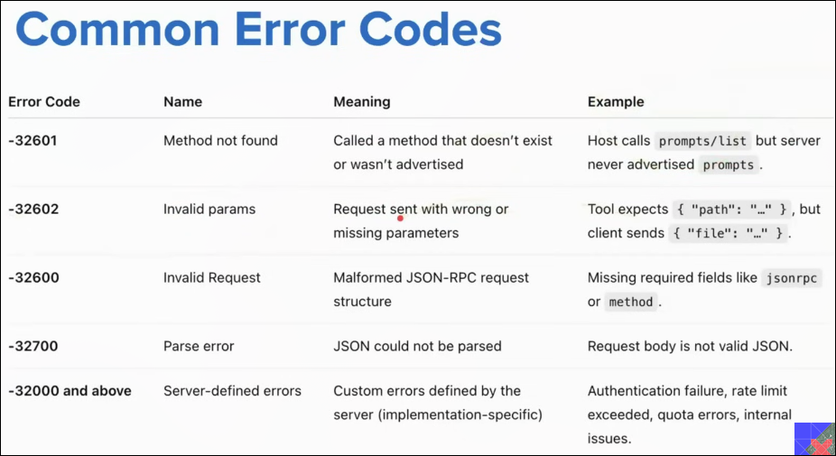

TIMEOUT 
after a fix interval of time we can get the request we simpliy reject it 
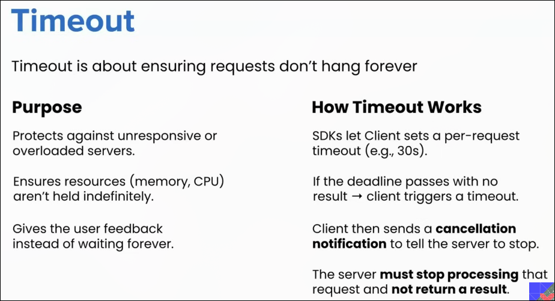

CANCELLATION 

client send the cancellation notification 
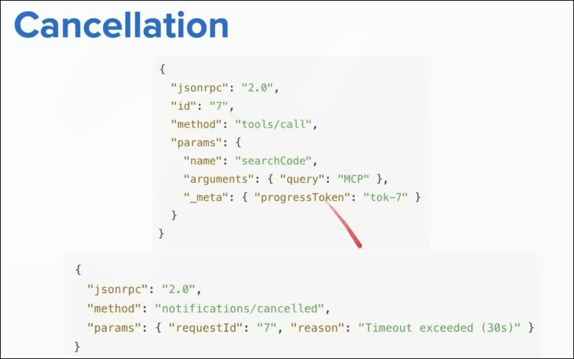

PROGRESS NOTIFICATION 

telling periodically  how much percent of work is   done 
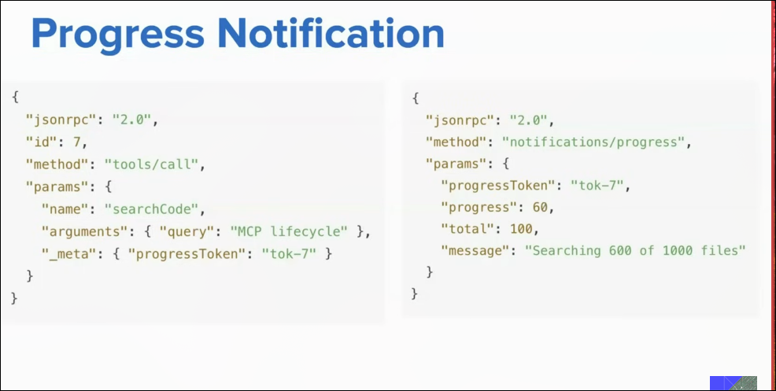