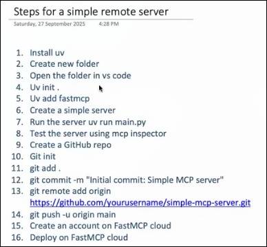

To run the mcp server use this command 

fastmcp run server.py --transport http --host 0.0.0.0 --port 8000

if u did not mention in which transport it is running then it runs byu default to the stdio dude 
To debug and test what the hell is going on use the 

uv run fastmcp dev main.py

Proxy server :) is a local mcp server lies between the claude desktop and the remote mcp 

and the proxy server connect to the remote mcp 

claude desktop talk to local mcp 

# Making the mcp client 

1. the FastMCP Client 
2. lang-chain-mcp-adaptor  simple + lang-chain and langGraph oriented 
3. mcp official library 

Most mcp server is manim used for the visualization 

for multiple 