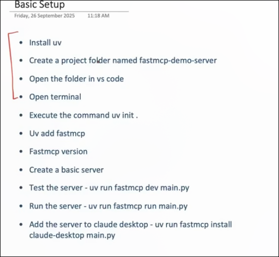
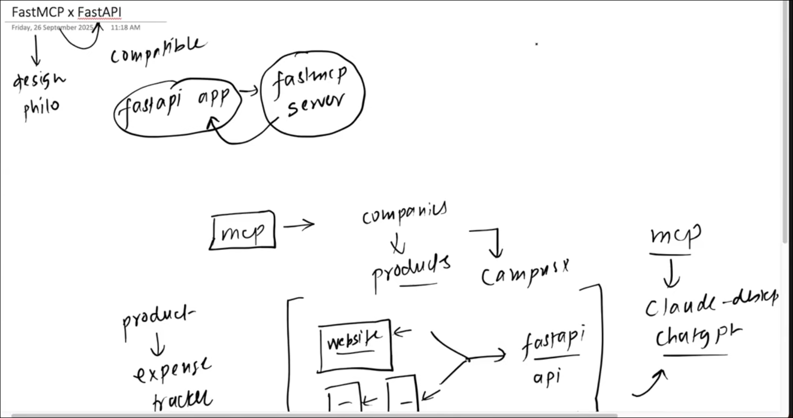

Some important Command for the mcp 

fastmcp version :> after Entering into  the venve environment 

after writing the code run the mcp inspector like the post man to test the api 

uv run  fastmcp dev main.py

To run the mcp server u have to do this dude 
 :>  uv run fastmcp run main.py 

 if u want to integrate the  running server into the claude ai 
  do this dude 
  uv run fastmcp install claude-desktop main.py

python  to mcp server conversion 

